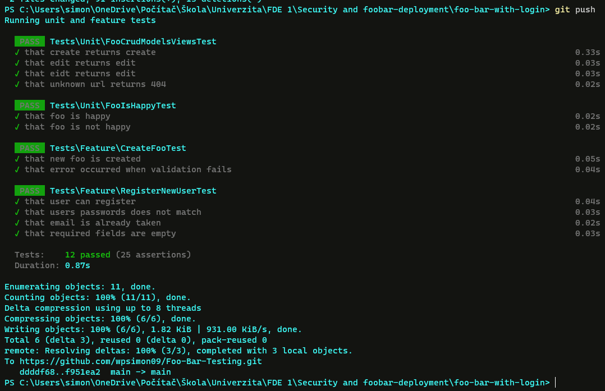

# Testing

## User stories

---

### As a user I want to create a profile so that I can access all of the features of the website
### Happy path

> **Given**: User wants to create a new Foo

> **When**: User registers or logs in

> **Then**: The application will allow him to preform actions on the Foo crud model

### Unhappy path

> **Given**: User wants to create a new Foo

> **When**: User tries to change url without logging in

> **Then**: He will be redirected to the login page

> **And**: User will be asked to login in or register

### How we will test it

---

> Happy path
- make a post request to the ``/`` which will trigger ``store`` function inside LoginRegister controller
  - the post request body will contain what would user enter in the create form
- we will check if respond has status ``302``
- we will check if the session has no errors
- we will check if the function returned redirect to the ``/dashboard``

> Unhappy path
- make a post request to the ``/`` which will trigger ``store`` function inside LoginRegister controller
    - the post request body will contain what would user enter in the create form however with some mistakes

**Not matching passwords**
    
- entered password are not matching
- check if session has error on password

**Already taken e-mail**

- create a new user
- in the body of request we will enter email of the previously created user
- check if session has error on email

**Empty required field**
- in the post request body we will pass an empty array 
- check if the session has error on email, password, name

with this approach we can test every required field at once

___

### As a user I want to create a new FOO so that I can have my FOOS up to date
### Happy path

> **Given**: User wants to create a new Foo

> **When**: User pressed on Create button on the index page 

> **And**: User fills in the create form without any errors 

> **Then**: User will be redirected to the index page showing the newly created foo

### Unhappy path

> **Given**: User wants to create a new Foo

> **When**: User pressed on Create button on the index page

> **And**: User fills in the create form without filling in the required field

> **And**: User will be asked to filled in the required fields

### How we will test it

---
### Feature test
> Happy path

- create a new user using factory
- set response to be acting as a newly created user 
- make a post request to the ``/foos`` which will trigger ``store`` method inside foos controller
  - request body will be what would user enter to form when creating a new foo in GUI
- we will check if the request status is _302_
- we will check if the session has no erros
- we will check if the database contains our newly created foo

> Unhappy path

- create a new user using factory
- set response to be acting as a newly created user
- make a post request to the ``/foos`` which will trigger ``stroe`` method inside foos controller
    - request body will be what would user enter to form when creating a new foo in GUI but with required filed empty and number field as string
- we will check if session has errors on bar and happiness

### Unit tests

> Foo model isHappy method 

this method should return true or false when happiness of given foo is bigger or equal to 10

**How to test it**

_For true_

- create a new foo with the happiness value of 20
- check if the method returns true

_For false_

- create a new foo with the happiness value of 2
- check if the method returns false

> Are foo model functions returning right views

**How to test it**

For _create, index, show_

- create a new user
- set response to be acting as user 
- make a get request to the appropriate route
- and check if the returned view is what you expect it to be 

>**NOTE**: during show you have to create a new foo and pass it to the get request as well

For _404/ non existent page_

- create a new user 
- set response to be acting as user
- make a get request to some wierd url
- check if the status of response if 404
---
## Showcase that git push will trigger tests

## Evaluation

Our test can detect wrong input from the user which is most crucial part of the application 
as well as they can detect wrong routes and uncorrected views returned by method
Furthermore test can also check the registration and crud process which can be 
really annoying to do by hand

Our tests do not cover login procedure because there was no user story created for it

It did not improve quality of our code because our test are not checking for mistakes made by programmer rather than mistakes made by user

